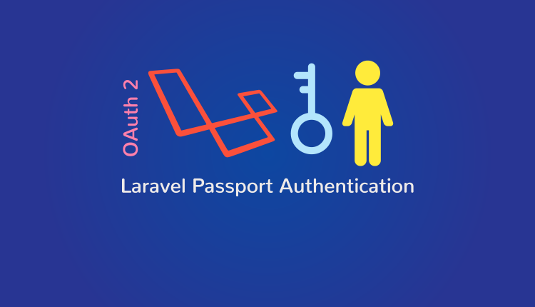

# Laravel Passport – Create REST API With Authentication
> register, login, user, produtos

# Teste prático 
> Laravel 6
> laravel/passport
> laravel/telescope

## Table of Contents	
* Creating a new project
* Install Package
* Adding Laravel Passport
* Service Provider
* Migration and Installation
* Passport Configure
* app/User.php
* AuthServiceProvider
* config/auth.php
* Create Route
* Create Controller for Authentication
* Create Product CRUD
* Testing

## Instalação 
* composer install
* npm install && npm run dev
* Renomei o arquivo .env.example para .env
* Configure o acesso do seu banco de dados no arquivo .env
* Configure APP_NAME do arquivo .env
* php artisan passport:install
* php artisan telescope:install
* php artisan key:generate --ansi
* php artisan migrate
* php artisan db:seed
* php artisan serve Ou php -S localhost:3333 -t public

Usuários
Existem dois tipos diferentes de usuários na aplicação:

Admin = secret (admin@teste.com.br)
User = secret

## Parte api
> post

- localhost:3333/api/register
- localhost:3333/api/login
- localhost:3333/api/user
- localhost:3333/api/products
- localhost:3333/api/products/2
* get, post, put, delete
- http://localhost:3333/telescope/requests

## Links de estudo
- https://tutsforweb.com/laravel-passport-create-rest-api-with-authentication/
- https://laravel.com/docs/6.x/telescope
- https://www.larashout.com/using-laravel-telescope-for-debugging
- https://medium.com/@nasrulhazim/laravel-telescope-dedicated-database-2f663d679bd8

> composer require laravel/telescope --dev

## Autor:
> Renato Lucena - 06/04/2020